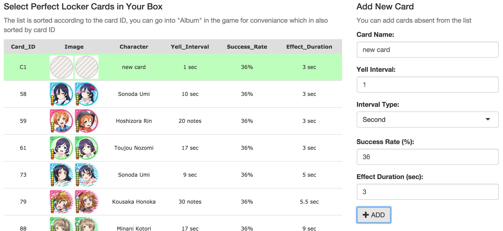
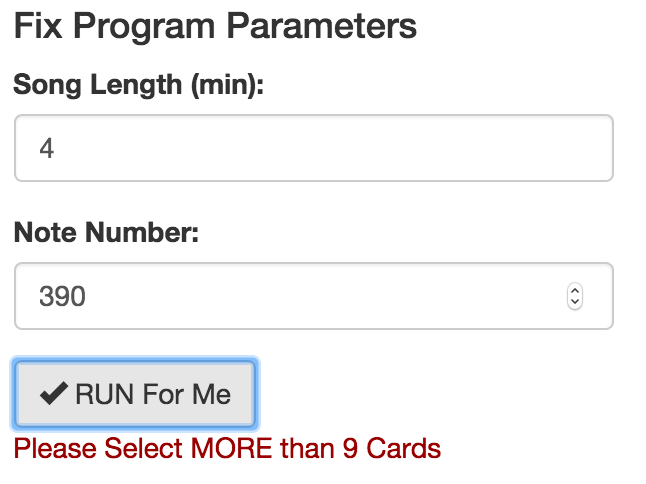
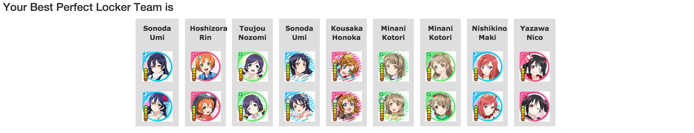

<script type="text/javascript">
    // add subtitle
    e = document.getElementsByTagName("header")[0]
    subtitle = document.createElement("p")
    subtitle.appendChild(document.createTextNode("A Love Live! SIF Game Helper Tool"))
    subtitle.setAttribute("style", "margin: 10px 0 0 0")
    author = document.createElement("span")
    author.appendChild(document.createTextNode("Li Yutze (Lytze)"))
    author.setAttribute("style", "font-size:75%;font-style:italic;color:#444")
    e.appendChild(subtitle)
    e.appendChild(author)

    // reactive table
    cardListRowClick = function(row) {
    if (row.cells[0].childNodes[1].checked) {
		row.cells[0].childNodes[1].checked = false
	}
	else {
		row.cells[0].childNodes[1].checked = true
	}

	if (row.cells[0].childNodes[1].checked) 
		row.setAttribute("style", "background-color: #bfb; text-shadow: 0px 0px 7px #777")
	else
		row.removeAttribute("style")
	$(row.cells[0].childNodes[1]).trigger("change")
}
</script>
<style>
section p, section li, section code{
    font-size: 65%
}
table.shtable {
    font-family: verdana,arial,sans-serif;
    font-size:11px;
	border-collapse: collapse;
	width: 100%;
}
table.shtable th {
	border-width: 1px;
	padding: 8px;
	background-color: #dedede;
	height: 70;
}
table.shtable td {
	padding: 3px;
	border-bottom-style: solid;
	border-bottom-width: 1px;
	border-bottom-color: #dedede;
}
table.shtable tbody tr {
	background-color: #ffffff;
	cursor: pointer;
}
table.shtable tr:hover {
	background-color: #ffb;
}
table.shtable tr td input {
	display: none;
}
</style>

## Outline

- - -

<br>

- _**Background**_: Love Live SIF, what does the App help for  
- _**Feathers and usage**_: the current version  
- _**Implementation**_: under the UI page, what happens  
- References and Linkouts

---

## Background

- - -


_**Love Live! School Idol Festival**_ is an popular mobile rytheme game, also part of the [Love Live! School Idol Project](), a multi-media project including TV animes, musics and lives, so on and also the mobile game. Our Shiny-app is designed as a _**helper tool**_ for the players of this game.  
As common _**rytheme game**_, hitting the note too late or early will break the combo, while combo number gives extra bonus in the game. But in Love Live SIF, cards of different characters may have skills which can add effect to the team to loosen the miss criterion. And these cards have such type of skill are called _**perfect-lockers**_.  
Our shiny-app is aimed to choose from perfect-locker cards having _**different parameters**_ (yell intervals, success rates and effect durations) the user has, to organize a best team that maximize the overall probability of having the effect during a live.

---

## Feathers and Usage

- - -

```{r echo=FALSE, results='asis', cache=FALSE}
card_list <- read.csv('LoveliveSIF_CNServer_pfLocker_card_list.csv', as.is = T)
card_list_o <- card_list
selected <- numeric()
Img <- paste('', sep = '')
card_list_o$CardID <- paste('<input type="checkbox" name="selectedCard" id="selectedCard',
                            1:nrow(card_list_o),
                            '" value="', card_list_o$CardID, '" ',
                            ifelse(card_list_o$CardID %in% selected,
                                   'checked="checked"', ''),
                            '/>', card_list_o$CardID, sep = '')
show_table <- cbind(Card_ID = card_list_o$CardID, Image = Img,
                    Character = card_list_o$Name,
                    Yell_Interval = paste(card_list_o$Jump,
                        ifelse(card_list_o$Type == 'S', 'sec', 'notes')),
                    Success_Rate = paste(card_list_o$Rate, '%', sep = ''),
                    Effect_Duration = paste(card_list_o$Duration, 'sec'))
innerHTMLTable <- kable(show_table, align = 'c', format = 'html', escape = F,
                        table.attr = 'class="shtable"')
innerHTMLTable <- gsub('<tr>\\n(\\s)+<td',
                       '<tr onclick="cardListRowClick(this)"><td',
                       innerHTMLTable)
cat(paste(
    '<div id="selectedCard" class="form-group shiny-input-checkboxgroup',
    'shiny-input-container" style="width: 100%">',
    '<div class="shiny-options-group">',
    innerHTMLTable,
    '</div></div>', sep = ''
))
```

<p/>

First, users need to select cards he/she has from the given list. Above is part of the list, which is accually a customed `checkboxGroupInput()`. The checkboxes are located on the first column in the list before the ID number, and set the hidden using additional __javascript__. Click (_**you can try it here**_) the row will check the coressponding box, which is also defined in the __javascript__, and render the input via __jQuery__ `.trigger("change")`.

---

## Feathers and Usage

- - -



Second, on the __right panel__ users can add cards that are not presented in the list.

---

## Feathers and Usage

- - -



Then, the user can fix the __parameters__, and __submit__ the run. If the user has selected less than 10 cards (sence the team is a collection of 9 cards), the app will warn the user the add more cards.

---

## Feathers and Usage

- - -

After submitting the form, the server will run for a while and return the best collection of cards.  
Using shiny's `withProgress()`, the app can tell the running progress of the program.



---

## Implementation

- - -

To find the best collection, the program need to optimize some effect value. In this case the value is defined as  
$$Effect = \sum_{time:\ T}{Pr(on\ perfect\ locking\ condition,\ time = T)}$$
And the probability for the state for time __T__ is
$$Pr(on\ condition,\ time = T) = 1 - \sum_{card:\ i}{1 - Pr(card = i,\ time = t,\ success)}$$
This shiny app utilized the _**Gibbs sampler**_ method to generate the optimized result, which could avoid local optimum for some extend.

---

## Implementation

- - -

Firstly the sampler will generate a random 9-card list from selected. For each iteration, the sampler _**discard**_ one card from the current list randomly according to the _**contribution**_ of that card to the effect.
$$Contribution_{card:\ i} = Effect_{current\ 9-card\ team} - Effect_{-card:\ i}$$
$$Pr_{discard,\ card:\ i} \propto max(Contribution) - Contribution_{card:\ i}$$
And then from the candidate list (including the just-discarded card), the sampler select one card randomly to insert back to the list, also, according to the contribution of each card.
$$Contribution_{card:\ i} = Effect_{+card:\ i} - Effect_{current\ 8-card\ team}$$
$$Pr_{insert,\ card:\ i} \propto Contribution_{card:\ i} - min(Contribution)$$

---

## Implementation

- - -

After certain number of iteration, or after the maximum effect has occurs for a certain time, the iteration stops, and the collection of cards that generates the maximum effect will be reported. The recorded effect during running may looks like:
```{r echo=FALSE, fig.align='center', fig.height=2.7, fig.width=10}
rec <- '177.8456 231.3542 267.4526 282.7093 297.7081 304.1603 313.3068 312.9422
        312.095 311.581 312.095 311.5056 312.5818 312.095 311.616 312.9422
        312.261 311.9067 312.8532 312.9281 312.9422 313.3068 313.3068 313.3068
        313.3068 313.0624 313.0624 313.0624 312.7747 311.6534 313.0624 313.0624
        311.8922 312.7747 311.616 310.7416 310.7416 310.7416 311.6534 311.6532
        311.2209 311.2209 312.5818 310.5617 310.9443 310.7631 312.032 310.807
        312.7747 312.9422 312.9422 312.9422 312.9422 312.9422 311.8008 313.3068'
rec <- as.numeric(strsplit(rec, '[ \n]+')[[1]])
library(lattice)
xyplot(rec ~ 1:100, panel = function(x, y, ...) {
    panel.xyplot(x - 0.5, y, col = '#a8cce5', type = 's', ...)
    panel.xyplot(x, y, col = '#D1E5F1', type = 'h', ...)
    panel.xyplot(x = x[which(rec == max(rec))], y = y[which(rec == max(rec))],
                 col = '#ee7621', type = 'p', ...)
}, xlab = 'Iterations', ylab = 'Effect')
```
In the figure, red dots are max recorded effects. In this case the program has maxium recorded effect more than threshold 5 times, so the iteration breaks at middle.

---

## References and Linkouts

- - -

<br>

- The official site for the mobile game [_**Love Live! SIF**_](http://www.school-fes.klabgames.net/)
- The Gibbs sampler method is inspired by [_**this video**_](https://www.youtube.com/watch?v=1EMonM7qAU8) on youtube
- And the shiny-app is hosted on my website: [_**English version**_](http://www.lytzeworkshop.com:3838/playground/shiny_app/best_pf_locker_en_ver/) and [_**中文版**_](http://www.lytzeworkshop.com:3838/playground/shiny_app/best_pf_locker_cn_ver/)
- The [_**github repo**_](https://github.com/lytze/LLSIF_best_perfect_locker_team) for this shiny-app
And welcome visiting [_**my homepage**_](http://www.lytzeworkshop.com/)
